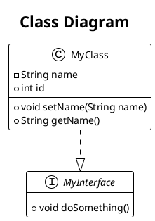

# Class Diagram Generation

## Overview

The class diagram generation feature analyzes Java projects to create UML class diagrams showing class structures, relationships, and dependencies.

## Features

### Class Analysis
- **Class Types**: Detects regular classes, abstract classes, and interfaces
- **Attributes**: Captures fields with visibility, type, and modifiers (static, final)
- **Methods**: Includes methods with visibility, parameters, return types, and modifiers
- **Constructors**: Identifies and includes constructor methods
- **Inheritance**: Detects superclass relationships
- **Interfaces**: Captures implemented interfaces

### Relationship Detection
- **Inheritance** (`extends`): Parent-child class relationships
- **Implementation** (`implements`): Interface implementations
- **Composition** (`--*`): Strong ownership relationships (final fields)
- **Aggregation** (`--o`): Weak ownership relationships (non-final fields)
- **Association** (`--`): General relationships between classes
- **Dependency** (`..>`): Usage dependencies

### Export Formats

#### PlantUML Format
Generates standard PlantUML class diagram syntax for visualization:



#### JSON Format
Structured data format for programmatic analysis:

```json
{
  "classDiagram": {
    "classCount": 22,
    "relationshipCount": 24,
    "classes": [...],
    "relationships": [...]
  }
}
```

## Usage Workflow

1. **Select Class Diagram** from main menu
2. **Enter project path** (default: `./src/main/java`)
3. **Choose scope**:
   - All Packages: Analyze entire project
   - Specific Package: Focus on particular package tree
4. **Review results**: See class count and relationship statistics
5. **Choose export format**:
   - JSON Format: For data analysis
   - PlantUML Format: For visualization
   - Both Formats: Export to both simultaneously
6. **Specify save path** and export

## Visualization

### PlantUML Viewers
- **Online**: http://www.plantuml.com/plantuml/
- **VS Code**: PlantUML extension
- **IntelliJ IDEA**: PlantUML integration plugin
- **Command line**: `plantuml classdiagram.puml`

### Benefits
- **Documentation**: Automatic UML diagram generation
- **Architecture review**: Visual project structure analysis
- **Refactoring support**: Understand class dependencies
- **Onboarding**: Help new developers understand codebase
- **Design validation**: Verify architectural patterns

## Technical Implementation

- **Spoon Framework**: AST-based Java code analysis
- **Visitor Pattern**: Systematic class structure traversal
- **Relationship Detection**: Automatic dependency analysis
- **Standard Formats**: PlantUML and JSON output
- **Package Filtering**: Scope control for large projects