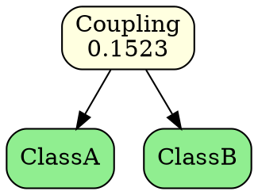

# Hierarchical Cluster Tree from Coupling Matrix

## Overview

The ClusterTree feature implements **hierarchical agglomerative clustering** to organize classes based on their coupling relationships. This creates a dendrogram (tree diagram) showing how classes are grouped together based on coupling strength.

## Algorithm

### Agglomerative Clustering with Average Linkage

The algorithm follows these steps:

1. **Initialize**: Start with each class as a separate cluster (leaf node)
2. **Find Maximum**: Identify the pair of clusters with the highest coupling value
3. **Merge**: Combine these two clusters into a new cluster
4. **Update Matrix**: Calculate new coupling values between the merged cluster and remaining clusters
5. **Repeat**: Continue until only one cluster remains (the root)

### Coupling Update Formula

When merging clusters C1 and C2 into a new cluster C_new, the coupling between C_new and any other cluster X is calculated using **average linkage**:

```
Coupling(C_new, X) = [Coupling(C1, X) + Coupling(C2, X)] / 2
```

This approach ensures that the new cluster's coupling reflects the average relationship strength of its components.

## Data Structure

### ClusterNode

Each node in the tree represents either:
- **Leaf Node**: A single class from the original code
- **Internal Node**: A merged cluster containing two child nodes

Properties:
- `id`: Unique identifier
- `name`: Class name (for leaves) or generated cluster name (for internal nodes)
- `left`: Left child node
- `right`: Right child node
- `couplingValue`: The coupling strength that caused this merge
- `isLeaf()`: Boolean indicating if this is a leaf node

### ClusterTree

The tree structure contains:
- `root`: The final merged cluster containing all classes
- `mergeHistory`: Chronological list of all merge operations
- `nodeIdCounter`: Auto-incrementing ID for nodes
- Methods for tree traversal and analysis

## Export Formats

### 1. JSON Format

Comprehensive tree structure with all merge information:

```json
{
  "clusterTree": {
    "depth": 5,
    "mergeSteps": 10,
    "root": {
      "id": 15,
      "name": "Cluster_...",
      "isLeaf": false,
      "couplingValue": 0.0234,
      "left": { ... },
      "right": { ... }
    },
    "mergeHistory": [
      {
        "step": 1,
        "clusterName": "Cluster_ClassA_ClassB",
        "couplingValue": 0.1523,
        "leftChild": "ClassA",
        "rightChild": "ClassB"
      },
      ...
    ]
  }
}
```

**Use cases**: 
- Programmatic analysis
- Integration with other tools
- Archive and version control

### 2. DOT Format (Graphviz)

Visual dendrogram representation:



**Features**:
- Color-coded: Green for classes, yellow for clusters
- Shows coupling values at merge points
- Top-down tree layout

**Visualization**: Use Graphviz tools:
```bash
dot -Tpng clustertree.dot -o clustertree.png
dot -Tsvg clustertree.dot -o clustertree.svg
```

### 3. Text Format

Human-readable ASCII tree:

```
Hierarchical Cluster Tree
=========================

Tree Depth: 5
Merge Steps: 10

Merge History (chronological):
------------------------------
Step 1: Merged 'ClassA' and 'ClassB' (coupling: 0.152300) -> 'Cluster_ClassA_ClassB'
Step 2: Merged 'ClassC' and 'ClassD' (coupling: 0.098700) -> 'Cluster_ClassC_ClassD'
...

Tree Structure:
---------------
└── Cluster_Root [coupling: 0.023400]
    ├── Cluster_Left [coupling: 0.067800]
    │   ├── ClassA
    │   └── ClassB
    └── Cluster_Right [coupling: 0.045600]
        ├── ClassC
        └── ClassD
```

**Use cases**:
- Quick inspection
- Documentation
- Terminal viewing
- Text-based diff tools

### 4. Newick Format

Phylogenetic tree format compatible with biology/evolution tools:

```
((ClassA:0.1523,ClassB:0.1523):0.0678,(ClassC:0.0987,ClassD:0.0987):0.0456):0.0234;
```

**Features**:
- Standard format used in bioinformatics
- Compact representation
- Branch lengths represent coupling values

**Visualization tools**:
- FigTree
- iTOL (Interactive Tree of Life)
- Phylo.io
- dendroscope

## User Workflow

### In the Application

1. **Start**: Select "Coupling Graph" from main menu
2. **Configure**: Enter project path and optional root package
3. **Generate**: System analyzes coupling relationships
4. **Review**: View coupling statistics
5. **Cluster**: Choose "Generate Cluster Tree" option
6. **Results**: See tree depth and merge steps
7. **Export**: Choose format(s) to export

### Export Menu Options

- **JSON Format**: Detailed structure data
- **DOT Format (Dendrogram)**: Visual graph
- **Text Format**: Human-readable tree
- **Newick Format**: Phylogenetic format
- **All Formats**: Export to all four formats
- **Skip Export**: Don't save (just view results)

## Interpretation

### Understanding the Tree

**Leaf Nodes**: Original classes in your codebase
- Appear at the bottom of the tree
- Labeled with class names

**Internal Nodes**: Merged clusters
- Represent groups of related classes
- Higher in the tree = merged later = weaker coupling

**Coupling Values**: Strength of relationship
- Higher values = stronger coupling
- First merges have highest values
- Later merges have lower values (averaging effect)

### Identifying Modules

Classes that merge early (high coupling) likely belong to the same logical module:

```
If ClassA and ClassB merge at coupling 0.15,
they probably form a cohesive component.

If this cluster merges with ClassC at 0.03,
ClassC might be loosely related or in a different module.
```

### Refactoring Insights

1. **High Early Merges**: Consider extracting into a separate package/module
2. **Late Merges with Low Coupling**: May indicate loosely coupled components (good!)
3. **Unexpected Groupings**: Might reveal hidden dependencies
4. **Balanced Tree**: Well-distributed coupling across codebase
5. **Skewed Tree**: Might indicate architectural issues

## Example Usage

### Scenario: Refactoring a Legacy System

1. Generate coupling graph for entire project
2. Generate cluster tree to identify natural groupings
3. Export to DOT format and visualize
4. Identify clusters that merge early (high coupling)
5. Examine if these clusters align with logical modules
6. Extract tightly coupled clusters into separate packages
7. Reduce coupling between loosely related clusters

### Scenario: Architecture Validation

1. Generate cluster tree for your codebase
2. Export to JSON for programmatic analysis
3. Compare tree structure to intended architecture
4. Identify violations (classes in wrong modules coupling highly)
5. Refactor to align implementation with design

## Technical Details

### Time Complexity

- **Initial matrix**: O(n²) where n = number of classes
- **Each merge iteration**: O(n²) to find max coupling
- **Total iterations**: n-1 merges
- **Overall**: O(n³) worst case

For typical projects (< 100 classes), this completes in seconds.

### Space Complexity

- **Coupling matrix**: O(n²)
- **Cluster nodes**: O(n)
- **Merge history**: O(n)
- **Overall**: O(n²)

### Algorithmic Variations

The current implementation uses **average linkage**. Other linkage methods could be implemented:

- **Single linkage**: min(coupling(C1,X), coupling(C2,X))
- **Complete linkage**: max(coupling(C1,X), coupling(C2,X))
- **Centroid linkage**: More complex calculation based on cluster centers

Average linkage provides a good balance and is less sensitive to outliers.

## Integration with Coupling Graph

The cluster tree is built directly from the coupling graph's normalized coupling matrix:

```
CouplingGraph → Normalized Matrix → ClusterTree
```

Workflow:
1. `CouplingGraphScanner` analyzes method calls
2. `CouplingGraph` calculates normalized coupling
3. `ClusterTree` performs hierarchical clustering
4. `ClusterTreeExporter` exports to various formats

All done in one integrated workflow through the UI.

## Limitations

1. **Symmetric Coupling**: Treats A→B and B→A as separate (currently)
2. **Binary Tree**: Each merge creates exactly 2 children
3. **No Backtracking**: Greedy algorithm, doesn't reconsider earlier merges
4. **Coupling Formula**: Based on method call counts only

## Future Enhancements

- [ ] Support for weighted coupling (fields, inheritance, etc.)
- [ ] Alternative linkage methods (single, complete, Ward's)
- [ ] Cluster stability analysis
- [ ] Automatic module suggestion based on tree cutting
- [ ] Integration with package structure validation
- [ ] Visualization in the terminal UI
- [ ] Cluster quality metrics (silhouette score, etc.)
