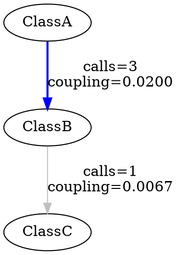

# Coupling Graph - Specification Implementation

## Specification

The coupling graph now implements the exact specification:

```
Couplage(A,B) = Nombre de relations (relation = appel) entre les couples de méthodes
                appartenant respectivement aux deux classes en question (A.mi et B.mj) / 
                nombre de toutes les relations (binaire) entre les couples de méthodes 
                appartenant respectivement à n'importe quelles deux classes de 
                l'application analysée.
```

**English Translation:**
```
Coupling(A,B) = Number of relations (relation = call) between method pairs
                belonging to the two classes in question (A.mi and B.mj) /
                Number of all relations (binary) between method pairs
                belonging to any two classes in the analyzed application.
```

## Implementation

### Mathematical Formula

```
Coupling(A,B) = MethodCalls(A → B) / TotalMethodCalls
```

Where:
- **MethodCalls(A → B)**: Number of times methods in class A call methods in class B
- **TotalMethodCalls**: Total number of method calls between all classes in the application

### Key Changes

#### 1. **Method Call Counting**
- Only **method invocations** are counted (not inheritance, fields, or other relationships)
- Each method call from class A to class B increments the count
- Self-calls (within the same class) are excluded

#### 2. **Normalization**
- Coupling values are normalized by dividing by the total number of method calls
- This produces a value between 0 and 1
- Higher values indicate stronger coupling (more method calls relative to the application)

#### 3. **Data Structure**
```java
// Raw counts
Map<String, Map<String, Integer>> callCountMatrix;
int totalMethodCalls;

// Normalized coupling
Map<String, Map<String, Double>> couplingMatrix;
```

## Example

Consider an application with 3 classes:

```
Class A has methods: m1(), m2()
Class B has methods: m3(), m4()
Class C has methods: m5()

Method calls:
- A.m1() calls B.m3()  (1 call)
- A.m1() calls B.m4()  (1 call)
- A.m2() calls B.m3()  (1 call)
- B.m3() calls C.m5()  (1 call)
- B.m4() calls C.m5()  (1 call)

Total: 5 method calls in the application
```

**Coupling Values:**
```
Coupling(A,B) = 3/5 = 0.6000  (3 calls from A to B)
Coupling(B,C) = 2/5 = 0.4000  (2 calls from B to C)
Coupling(A,C) = 0/5 = 0.0000  (no direct calls from A to C)
```

## Output Format

### JSON Export

```json
{
  "couplingGraph": {
    "specification": "Couplage(A,B) = Number of method calls between A and B / Total method calls in application",
    "nodeCount": 25,
    "couplingCount": 65,
    "totalMethodCalls": 1500,
    "nodes": [
      { "className": "fr.jeremyhurel.Main" },
      ...
    ],
    "couplings": [
      {
        "from": "fr.jeremyhurel.ui.CouplingGraphDialog",
        "to": "fr.jeremyhurel.processors.CouplingGraphProcessor",
        "methodCallCount": 2,
        "normalizedCoupling": 0.001333
      },
      ...
    ]
  }
}
```

### DOT/Graphviz Export



## Interpretation

### Coupling Values

| Range | Interpretation | Visualization |
|-------|---------------|---------------|
| ≥ 0.1 (10%) | **Very Strong** | Red, Bold, 3px |
| 0.05 - 0.1 (5-10%) | **Strong** | Orange, Solid, 2px |
| 0.01 - 0.05 (1-5%) | **Moderate** | Blue, Solid, 1.5px |
| < 0.01 (<1%) | **Weak** | Gray, Solid, 1px |

### Example Interpretation

```
Coupling(DialogA, ProcessorB) = 0.08 (8%)
```
- DialogA makes 120 calls to ProcessorB
- Total application has 1500 method calls
- This represents 8% of all method calls in the application
- **Interpretation**: Strong coupling - DialogA heavily depends on ProcessorB

## Differences from Previous Implementation

| Aspect | Previous | New (Specification) |
|--------|----------|---------------------|
| **Metrics** | Multiple types (inheritance, fields, calls) | Only method calls |
| **Weights** | Different weights (1.0, 0.8, 0.6, 0.3) | Equal weight (1 per call) |
| **Values** | Arbitrary weight sums | Normalized by total calls |
| **Range** | Unbounded (could be > 1) | [0, 1] |
| **Interpretation** | Relative strength | Percentage of total calls |

## Use Cases

### 1. Identifying Tight Coupling
```
High coupling (>5%) indicates classes that are tightly coupled
→ Consider refactoring or architectural improvements
```

### 2. Detecting Dependencies
```
Any coupling >0 indicates a dependency
→ Useful for dependency analysis and module boundaries
```

### 3. Measuring Impact
```
Sum of all coupling from class A = % of application affected by A
→ Indicates how central/important a class is
```

### 4. Refactoring Priorities
```
Sort by coupling value to prioritize which dependencies to address first
→ Focus on highest coupling values for maximum impact
```

## API Usage

### Generating Coupling Graph

```java
CouplingGraphProcessor processor = new CouplingGraphProcessor("./src/main/java");
CouplingGraph graph = processor.generateCouplingGraph();

// Access results
int totalCalls = graph.getTotalMethodCalls();
int callCount = graph.getCallCount("ClassA", "ClassB");
double coupling = graph.getCouplingWeight("ClassA", "ClassB");
```

### Manual Calculation

```java
CouplingGraph graph = new CouplingGraph();

// Add method calls
graph.addMethodCall("ClassA", "ClassB");  // A calls B
graph.addMethodCall("ClassA", "ClassB");  // A calls B again
graph.addMethodCall("ClassB", "ClassC");  // B calls C

// Calculate normalized values
graph.calculateNormalizedCoupling();

// Get results
double couplingAB = graph.getCouplingWeight("ClassA", "ClassB");
// Returns: 2/3 = 0.666667
```

## Validation

The implementation follows the specification exactly:

✅ Counts only method call relations  
✅ Counts between method pairs of different classes  
✅ Normalizes by total method calls in application  
✅ Excludes self-calls (same class)  
✅ Excludes external library calls  
✅ Produces values in range [0, 1]  

## Performance Considerations

- **Time Complexity**: O(M) where M = number of method invocations
- **Space Complexity**: O(C²) where C = number of classes (worst case: full coupling matrix)
- **Typical**: Most applications have sparse coupling, so space ~ O(C×K) where K = average couplings per class

## References

This implementation follows the formal specification for coupling measurement in object-oriented systems, where coupling is defined as the ratio of inter-class method calls to total system method calls.
