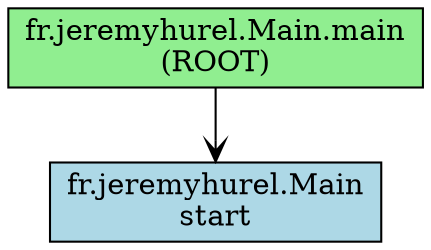

# Call Graph Export Formats

## Graphviz DOT Format

The call graph can be exported in Graphviz DOT format, which allows you to visualize the method call relationships as directed graphs.

### DOT File Structure

The generated DOT file includes:
- **Directed graph declaration**: `digraph CallGraph`
- **Graph styling**: Top-to-bottom layout, box-shaped nodes, colored edges
- **Root node highlighting**: The root method is highlighted in light green
- **Node labels**: Class name and method name on separate lines
- **Edges**: Directed arrows showing call relationships

### Example DOT Output



### Viewing DOT Files

You can visualize DOT files using:

1. **Graphviz command line tools**:
   ```bash
   dot -Tpng callgraph.dot -o callgraph.png
   dot -Tsvg callgraph.dot -o callgraph.svg
   dot -Tpdf callgraph.dot -o callgraph.pdf
   ```

2. **Online viewers**:
   - http://magjac.com/graphviz-visual-editor/
   - https://dreampuf.github.io/GraphvizOnline/

3. **VS Code extensions**:
   - Graphviz (dot) language support
   - Graphviz Preview

### Benefits of DOT Format

- **Standard format**: Widely supported by many tools
- **Scalable**: Works well for both small and large graphs
- **Customizable**: Easy to modify styling and layout
- **Multiple output formats**: Can be converted to PNG, SVG, PDF, etc.
- **Interactive**: Some viewers support zooming and panning

## JSON Format

Also available for programmatic processing and data analysis.