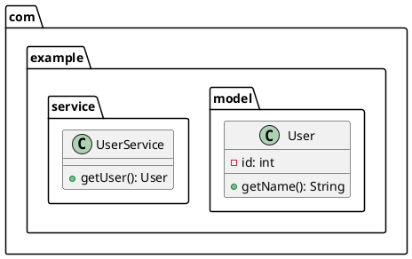

# Package Encapsulation Feature

## Overview

The package encapsulation feature allows users to group classes by their package structure when generating class diagrams. This improves readability for large projects with many packages.

## How It Works

### User Flow

1. User selects "Generate Class Diagram" from the main menu
2. User enters the project path to analyze
3. User selects root package (or all packages)
4. System generates the class diagram
5. System shows results with:
   - Total classes found
   - Total packages found
   - Total relationships
   - Root package name
6. **NEW**: User is asked: "Group classes by package in diagram?"
   - Option 1: "Yes - Show packages" - Groups classes within package blocks
   - Option 2: "No - Flat structure" - All classes at the same level
7. User selects export format (JSON, PlantUML, or both)

### Model Changes

**ClassDiagram.java** now includes:
- `packageEncapsulation` boolean field (default: false)
- `getAllPackages()` - Returns set of all package names
- `getClassesByPackage(String packageName)` - Returns classes in a specific package
- `getPackageCount()` - Returns number of unique packages

### Export Format Changes

#### JSON Export
Includes two new fields:
```json
{
  "packageCount": 5,
  "packageEncapsulation": true,
  ...
}
```

#### PlantUML Export

**Without package encapsulation (flat structure):**


**With package encapsulation:**


## Benefits

1. **Better Organization**: Large projects with many packages become more readable
2. **Visual Hierarchy**: Package structure is visually represented in diagrams
3. **Flexible**: Users can choose flat or grouped view based on their needs
4. **Standard PlantUML**: Uses standard PlantUML package syntax for compatibility

## Implementation Details

### ClassDiagram Model
- Added package-related methods to query and organize classes by package
- Package names are extracted from fully qualified class names
- Package count is calculated from unique package names

### ClassDiagramExporter
- PlantUML exporter checks `isPackageEncapsulation()` flag
- When enabled, wraps classes in `package "name" { ... }` blocks
- Indentation is properly handled for nested content
- Classes are grouped by their package name

### ClassDiagramDialog
- New `askForPackageEncapsulation()` dialog step
- Presents user with clear yes/no options
- Sets the flag on the ClassDiagram model before export
- Results display now shows package count

## Testing

To test the feature:

1. Run the application:
   ```bash
   java -jar target/java-refactoring-tool-1.1-SNAPSHOT-jar-with-dependencies.jar
   ```

2. Select "Generate Class Diagram"
3. Enter a project path with multiple packages
4. Choose "All Packages" or specify a root
5. When prompted for package encapsulation:
   - Test with "Yes - Show packages"
   - Test with "No - Flat structure"
6. Export to PlantUML and verify the output structure

## Example Output

For a project with structure:
```
com.example.model.User
com.example.model.Product
com.example.service.UserService
com.example.repository.UserRepository
```

**With encapsulation enabled**, PlantUML output will group:
- User and Product under package "com.example.model"
- UserService under package "com.example.service"
- UserRepository under package "com.example.repository"

**Without encapsulation**, all classes appear at the same level with full names.
