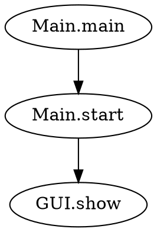
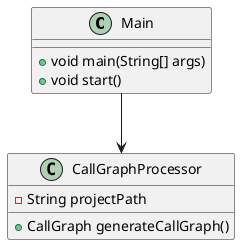

# Java Refactoring & Analysis Tool 🚀

[](https://github.com/jeremyhurel/java-refactoring-tool/actions/workflows/ci-cd.yml)
[](https://github.com/jeremyhurel/java-refactoring-tool/actions/workflows/quality-security.yml)
[](https://codecov.io/gh/jeremyhurel/java-refactoring-tool)
[](https://sonarcloud.io/summary/new_code?id=jeremyhurel_java-refactoring-tool)

A comprehensive Java analysis tool with a **beautiful terminal UI** that generates call graphs, class diagrams, coupling analysis, and intelligent module extraction using the Spoon framework.

## ✨ What's New in v1.1

- 🎨 **Completely redesigned UI** with emoji icons and professional styling
- ⚖️ **New Combined Strategy** for module extraction (Fixed Count + Threshold)
- 📊 **Enhanced results display** with detailed module breakdowns
- 🔄 **Step-by-step workflow** with progress indicators
- 📚 **Comprehensive in-app help** documentation
- ✅ **Better error messages** with helpful guidance
- 🎯 **Parameter recommendations** for all strategies

## 🎯 Features

### � Class Diagram Generation
- Generate UML class diagrams from Java source code
- Export to **PlantUML** format for professional diagrams with color-coding
- Export to **JSON** format for data analysis
- Detect relationships: inheritance, implementation, composition, aggregation
- Analyze attributes, methods, and constructors
- **Package encapsulation**: Group classes by package structure
- **Color-coded output**: Interfaces (blue), Abstract classes (yellow), Concrete classes (green)

### 🔗 Call Graph Analysis
- Analyze method call relationships across your Java project
- Export to **Graphviz DOT** format for visualization
- Export to **JSON** format for programmatic analysis
- Support for filtering by root class/method
- Identify call chains and dependencies

### 🔄 Coupling Graph Analysis
- Analyze coupling relationships between classes based on method calls
- Calculate normalized coupling using formula: `Couplage(A,B) = Calls(A→B) / Total Calls`
- Filter external libraries (Java stdlib, frameworks, third-party)
- Export to **JSON** and **DOT** formats
- **Node Coupling Values**: Each node stores its total outgoing coupling strength
- **Node Merging**: Support for combining nodes (useful for clustering)
- **Hierarchical Cluster Tree**: Generate dendrograms showing class groupings
  - Agglomerative clustering with average linkage
  - Export to JSON, DOT, Text, and Newick formats
  - Identify natural module boundaries
  - Support refactoring decisions
- See [COUPLING_NODE_FEATURES.md](COUPLING_NODE_FEATURES.md) for detailed documentation

### 📦 Module Extraction ⭐ (Enhanced in v1.1)
- **Automatic module detection** from coupling analysis using hierarchical clustering
- **Four clustering strategies**:
  - 🤖 **Automatic Elbow Method**: Intelligently determines optimal module count
  - 🎯 **Fixed Count**: Extract exactly N modules (user-specified)
  - 📊 **Coupling Threshold**: Split based on minimum coupling strength
  - ⚖️ **Combined** (NEW): Mix fixed count with threshold for controlled extraction
- **Export formats**:
  - **Text**: Human-readable module listings with statistics
  - **PlantUML**: Visual class diagram with modules as packages
- **Visual module boundaries** with color-coded classes and cohesion metrics
- **Detailed results** showing module distribution and cohesion values
- **Terminal UI integration** with interactive module extraction workflow
- See [MODULE_EXTRACTION_GUIDE.md](MODULE_EXTRACTION_GUIDE.md) for complete guide

### �📈 Project Statistics
- **13 comprehensive metrics** including:
  - Number of classes, methods, packages
  - Lines of code analysis
  - Average methods per class
  - Average lines of code per method
  - Top 10% classes by methods/attributes
  - Classes with high complexity
  - Maximum parameters per method
- Export to **TXT** format
- Display results in terminal UI

## Quick Start

### Prerequisites
- Java 17 or higher
- Maven 3.6 or higher
- (Optional) Graphviz for visualizations

### Installation

1. Clone the repository:
```bash
git clone https://github.com/jeremyhurel/java-refactoring-tool.git
cd java-refactoring-tool
```

2. Build and run with the convenient script:
```bash
./run.sh
```

Or manually:
```bash
mvn clean package
java -jar target/java-refactoring-tool-1.1-SNAPSHOT-jar-with-dependencies.jar
```

### Run Commands

The project includes a convenient `run.sh` script for all common operations:

```bash
./run.sh              # Run the application (builds if needed)
./run.sh build        # Build the project
./run.sh test         # Run tests
./run.sh export       # Generate test exports
./run.sh visualize    # Create PNG/SVG from DOT files
./run.sh full         # Complete workflow (clean, build, test, export, visualize)
./run.sh help         # Show all available commands
```

See [RUN_COMMANDS.md](RUN_COMMANDS.md) for complete documentation.

### Usage

1. **Interactive Mode**: Run the application and use the terminal UI
   ```bash
   ./run.sh
   ```

2. **Command Line Examples**:
   ```bash
   # Generate test exports
   ./run.sh export
   
   # Create visualizations
   ./run.sh visualize
   
   # Complete workflow
   ./run.sh full
   ```

## Output Formats

### Call Graphs
- **DOT Format**: Compatible with Graphviz for visualization
- **JSON Format**: Machine-readable data structure

### Class Diagrams
- **PlantUML Format**: Standard UML diagram syntax with automatic color-coding
  - Interfaces: Light blue background
  - Abstract classes: Light yellow background
  - Concrete classes: Light green background
  - Packages: WhiteSmoke background with gray borders
- **JSON Format**: Structured class information

### Statistics
- **TXT Format**: Human-readable statistics report
- **Terminal Display**: Interactive results viewing

## CI/CD Pipeline

Our project uses a comprehensive CI/CD pipeline with the following features:

### ✅ Continuous Integration
- **Multi-Java Version Testing**: Java 17 and 21
- **Automated Testing**: Unit tests with Maven Surefire
- **Code Coverage**: JaCoCo integration with 70% minimum threshold
- **Quality Gates**: Checkstyle, PMD, SpotBugs analysis

### 🔒 Security & Quality
- **OWASP Dependency Check**: Vulnerability scanning
- **Snyk Security Analysis**: Advanced security scanning
- **SonarCloud Integration**: Code quality analysis
- **Performance Testing**: Memory and execution time validation

### 🚀 Deployment
- **Automated Builds**: JAR artifacts with dependencies
- **Release Automation**: GitHub releases with artifacts
- **Integration Testing**: End-to-end functionality validation

### 🔄 Maintenance
- **Dependency Updates**: Weekly automated dependency updates
- **Security Monitoring**: Daily security scans
- **Quality Monitoring**: Continuous code quality tracking

## Development

### Local Development Setup

1. **Clone and Setup**:
```bash
git clone https://github.com/jeremyhurel/java-refactoring-tool.git
cd java-refactoring-tool
mvn clean compile
```

2. **Run Tests**:
```bash
mvn test
```

3. **Code Quality Checks**:
```bash
mvn checkstyle:check pmd:check spotbugs:check
```

4. **Generate Coverage Report**:
```bash
mvn jacoco:report
```

### Contributing

1. Fork the repository
2. Create a feature branch (`git checkout -b feature/amazing-feature`)
3. Commit your changes (`git commit -m 'Add amazing feature'`)
4. Push to the branch (`git push origin feature/amazing-feature`)
5. Open a Pull Request

### Code Quality Standards

- **Test Coverage**: Minimum 70% line coverage
- **Code Style**: Google Java Style Guide
- **Security**: No high/critical vulnerabilities
- **Performance**: Memory usage under 256MB for standard analysis

## Architecture

### Core Components
- **Spoon Framework**: AST-based Java code analysis
- **Lanterna**: Terminal-based user interface
- **Visitor Pattern**: Systematic code traversal
- **Export System**: Multi-format output generation

### Project Structure
```
src/main/java/fr/jeremyhurel/
├── Main.java                 # Application entry point
├── models/                   # Data models
├── processors/               # Analysis processors
├── scanners/                 # Code scanners (visitors)
├── ui/                      # Terminal UI dialogs
├── utils/                   # Export utilities
└── test/                    # Test utilities
```

## Visualization Examples

### Call Graph (DOT)


### Class Diagram (PlantUML)


## License

This project is licensed under the MIT License - see the [LICENSE](LICENSE) file for details.

## Acknowledgments

- [Spoon Framework](https://spoon.gforge.inria.fr/) for AST analysis
- [Lanterna](https://github.com/mabe02/lanterna) for terminal UI
- [PlantUML](https://plantuml.com/) for UML diagram format
- [Graphviz](https://graphviz.org/) for graph visualization

## Support

- 📧 Issues: [GitHub Issues](https://github.com/jeremyhurel/java-refactoring-tool/issues)
- 📚 Documentation: [Wiki](https://github.com/jeremyhurel/java-refactoring-tool/wiki)
- 💬 Discussions: [GitHub Discussions](https://github.com/jeremyhurel/java-refactoring-tool/discussions)